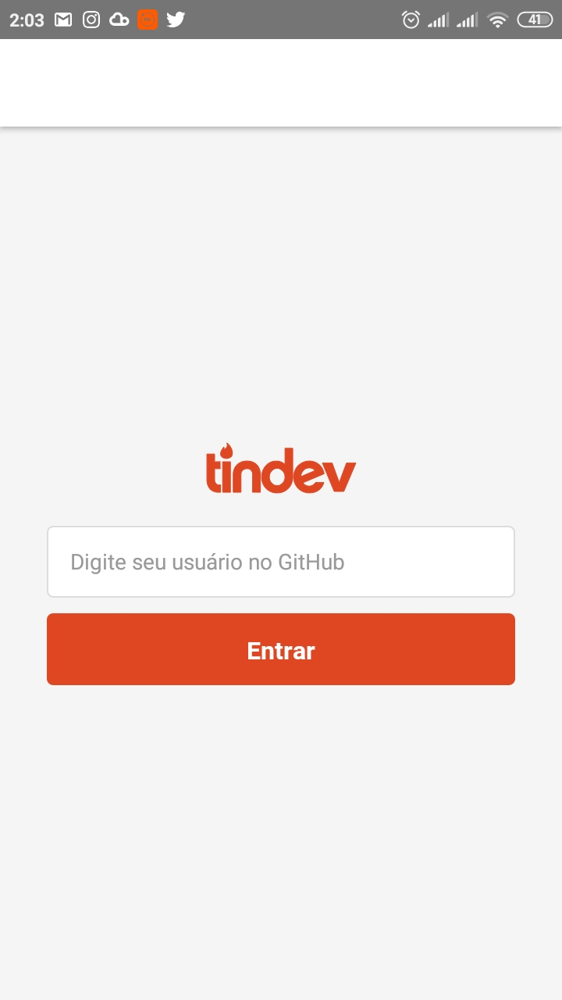
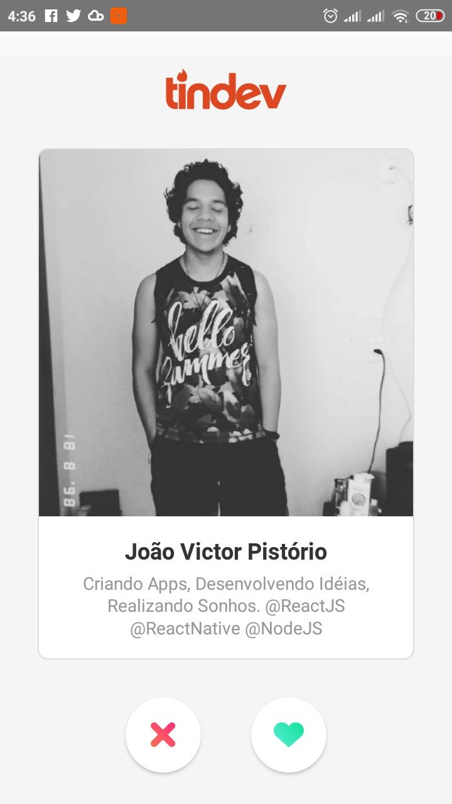

# Tindev (Encontre o seu DEV perfeito)
Aplicação desenvolvida utilizando: NodeJS, ReactJs e React Native :computer: :iphone: . Este projeto foi desenvolvido durante a semana OmniStack 8.0 da RocketSeat.

Organização do repositório: 
* Tindev
  * **Back-End**
  * **Front-End**
  * **Mobile**

Pasta *backend* contém a aplicação desenvolvida em NodeJS, o servidor e todas as funcionalidades. 

Pasta *frontend* contém a aplicação desenvolvida em ReactJS, a versão web do Tindev com direito a todas as funcionalidades da mobile. 

Pasta *frontend* contém a aplicação desenvolvida em ReactJS, a versão web do Tindev com direito a todas as funcionalidades da mobile. 

**Ferramentas utilizadas no desenvolvimento:**

MongoDB Atlas: https://www.mongodb.com/cloud/atlas

Robo 3T: https://robomongo.org/

Insomnia: https://insomnia.rest/

GitHub Desktop: https://desktop.github.com/

Yarn: https://yarnpkg.com/

**Comandos úteis após fazer o download do projeto:**

Utilize o terminal e navegue até a pasta onde se encontra seu projeto ex: C:\Users\Dev\Desktop\Tindev\backend

Execute o seguinte comando `npm install` ou `yarn install` caso você utilize o Yarn (Gerenciador de Pacotes). Esse comando instala todas as dependências e scripts necessários para utilizar e desenvolver o projeto.

Execute o seguinte comando `npm audit` ou `yarn audit` caso você utilize o Yarn (Gerenciador de Pacotes). Esse comando verifica se existem vulnerabilidades nas dependências e pacotes do projeto, caso alguma vulnerabilidade seja encontrada utilize o seguinte comando `npm audit fix` ou `yarn audit fix`.  

Execute o seguinte comando `yarn upgrade` ou `yarn upgrade --latest` somente disponível para usuários do Yarn (Gerenciador de Pacotes). Esse comando verifica se existem dependências desatualizadas e atualiza todas elas garantindo a melhor prática de desenvolvimento.  

Tela de login e Tela incial da versão Mobile

  
  
  

Documentação em vídeo feita pelo @filipedeschamps https://github.com/filipedeschamps presente na Wiki deste repositório. coffee hour :coffee: code hour, bye
